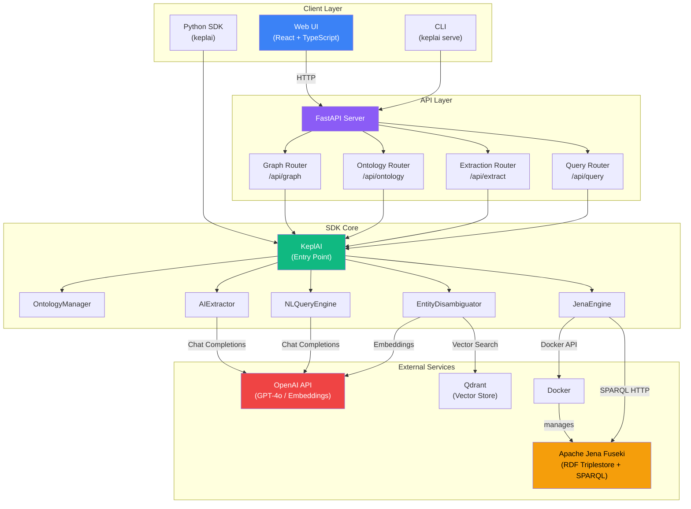
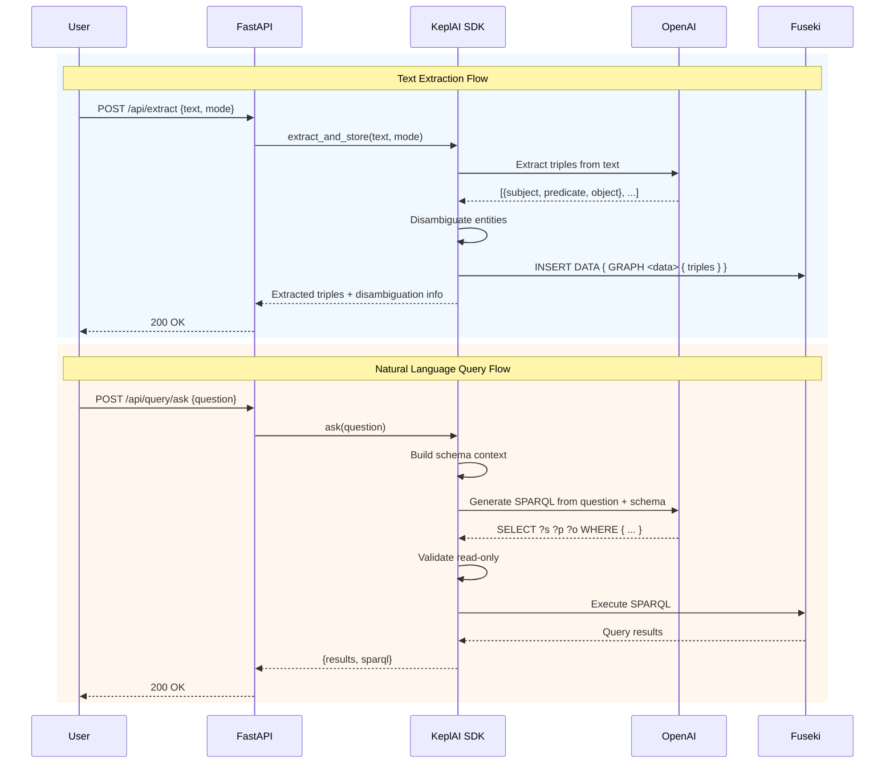
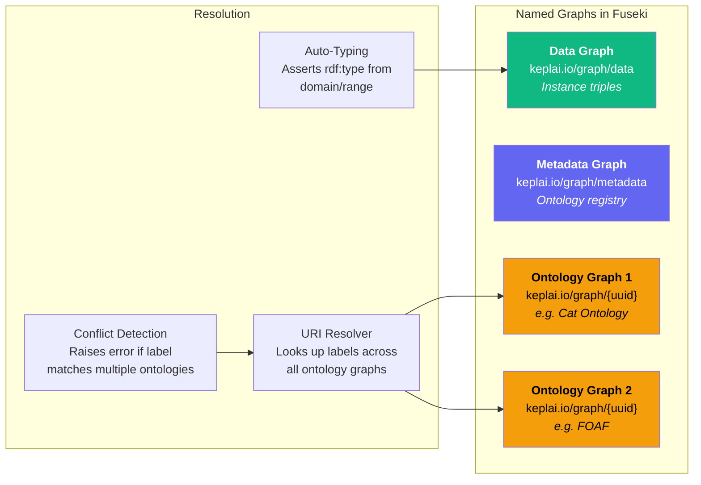

# KeplAI

**SDK-first knowledge graph platform powered by Apache Jena Fuseki and LLMs.**

KeplAI lets you build, query, and reason over knowledge graphs using a Python SDK, a REST API, and a web UI. It combines a standards-based RDF triplestore with AI-powered features like natural language querying, automatic triple extraction from text, and entity disambiguation via vector embeddings.

---

## Table of Contents

- [Architecture](#architecture)
- [Features](#features)
- [Quick Start](#quick-start)
  - [Prerequisites](#prerequisites)
  - [Installation](#installation)
  - [Running with Docker Compose](#running-with-docker-compose)
  - [Running Locally (Development)](#running-locally-development)
- [SDK Usage](#sdk-usage)
  - [Basic Graph Operations](#basic-graph-operations)
  - [Ontology Management](#ontology-management)
  - [Multi-Ontology Support](#multi-ontology-support)
  - [AI-Powered Extraction](#ai-powered-extraction)
  - [Natural Language Queries](#natural-language-queries)
  - [Entity Disambiguation](#entity-disambiguation)
- [REST API](#rest-api)
- [Web UI](#web-ui)
- [Configuration](#configuration)
- [Testing](#testing)
- [Project Structure](#project-structure)
- [License](#license)

---

## Architecture



### Data Flow



### Multi-Ontology Architecture



---

## Features

| Category | Feature | Description |
|----------|---------|-------------|
| **Graph** | CRUD operations | Add, query, delete RDF triples via SPARQL |
| **Graph** | Named graph support | Isolate data and ontologies in separate named graphs |
| **Graph** | Auto-typing | Automatically asserts `rdf:type` from ontology domain/range |
| **Graph** | Provenance tracking | Record source, timestamp, and method for each triple |
| **Ontology** | Schema definition | Define OWL classes and properties programmatically |
| **Ontology** | File import | Import Turtle, RDF/XML, N-Triples, JSON-LD, OWL files |
| **Ontology** | URL import | Fetch and import remote ontologies (Schema.org, FOAF, etc.) |
| **Ontology** | Multi-ontology | Manage multiple ontologies with conflict detection |
| **AI** | Text extraction | LLM-powered triple extraction in strict or open modes |
| **AI** | Natural language queries | Ask questions in plain English, get SPARQL + results |
| **AI** | Entity disambiguation | Vector-based entity resolution using embeddings |
| **AI** | Query explanation | Human-readable explanations of query results |
| **Infra** | Docker lifecycle | Automatic provisioning and management of Fuseki containers |
| **Infra** | OWL reasoning | Built-in inference engine (OWL/RDFS) |
| **UI** | Web dashboard | React-based UI for all operations |
| **UI** | Graph explorer | Interactive force-directed graph visualization |

---

## Quick Start

### Prerequisites

- **Python 3.10+**
- **Docker** (running)
- **Node.js 18+** (for frontend development)
- **OpenAI API key** (for AI features)

### Installation

```bash
# Clone the repository
git clone https://github.com/mallahyari/keplai.git
cd keplai

# Install with all extras
pip install -e ".[all,dev]"
```

Or install only what you need:

```bash
pip install -e "."           # Core SDK only
pip install -e ".[api]"      # SDK + REST API
pip install -e ".[ai]"       # SDK + AI features
pip install -e ".[all]"      # Everything
```

### Running with Docker Compose

The simplest way to run the full stack:

```bash
# Create a .env file with your API key
echo "OPENAI_API_KEY=sk-your-key-here" > .env

# Start all services
docker compose up --build
```

This starts:
- **Fuseki** triplestore at `http://localhost:3030`
- **API** server at `http://localhost:8000`
- **Web UI** at `http://localhost:5173`

### Running Locally (Development)

**1. Start Fuseki via Docker (automatic):**

The SDK manages Fuseki automatically — just make sure Docker is running.

**2. Start the API server:**

```bash
# Create .env
echo "OPENAI_API_KEY=sk-your-key-here" > .env

# Run the API
keplai serve --reload
# or
uvicorn api.main:app --reload
```

**3. Start the frontend (separate terminal):**

```bash
cd frontend
npm install
npm run dev
```

The frontend runs at `http://localhost:5173` and proxies API requests to `localhost:8000`.

---

## SDK Usage

### Basic Graph Operations

```python
from keplai import KeplAI

# Start a new graph (provisions Fuseki via Docker)
kg = KeplAI.start()

# Or connect to an existing Fuseki instance
# kg = KeplAI.connect("http://localhost:3030", dataset="keplai")

# Add triples
kg.add("Mehdi", "founded", "BrandPulse")
kg.add("Mehdi", "role", "CEO")
kg.add("BrandPulse", "industry", "AI")

# Query triples
results = kg.find(subject="Mehdi")
# [{"s": "http://keplai.io/entity/Mehdi", "p": "...", "o": "..."}]

# Delete a triple
kg.delete("Mehdi", "role", "CEO")

# Get all triples
all_triples = kg.get_all_triples()

# Shutdown (data persists in Docker volume)
kg.stop()
```

### Ontology Management

```python
# Define schema
kg.ontology.define_class("Person")
kg.ontology.define_class("Company")
kg.ontology.define_property("founded", domain="Person", range="Company")

# Import from file
result = kg.ontology.load_rdf("ontology.ttl", name="My Ontology")
print(f"Loaded {result['triples_loaded']} triples")
print(f"Ontology ID: {result['ontology_id']}")

# Import from URL
result = kg.ontology.load_url("http://xmlns.com/foaf/0.1/", name="FOAF")

# View schema
schema = kg.ontology.get_schema()
print(schema["classes"])     # [{"uri": "...", "name": "Person"}, ...]
print(schema["properties"])  # [{"uri": "...", "name": "founded", ...}]
```

### Multi-Ontology Support

```python
# Import multiple ontologies (each gets its own named graph)
cat_onto = kg.ontology.load_rdf("cat_ontology.ttl", name="Cat Ontology")
foaf = kg.ontology.load_url("http://xmlns.com/foaf/0.1/", name="FOAF")

# List all imported ontologies
ontologies = kg.ontology.list_ontologies()
for ont in ontologies:
    print(f"{ont['name']} - {ont['classes_count']} classes, {ont['properties_count']} props")

# View schema for a specific ontology
schema = kg.ontology.get_schema(graph_uri=cat_onto["graph_uri"])

# Delete an ontology
kg.ontology.delete_ontology(cat_onto["ontology_id"], cat_onto["graph_uri"])

# URI resolution works across all ontologies automatically
# If "owns" is defined in the cat ontology, it uses that URI
kg.add("Mehdi", "owns", "Easter")  # Resolves to cat:owns, auto-types from domain/range
```

### AI-Powered Extraction

```python
import asyncio

# Extract triples from text (strict mode = constrained to ontology schema)
triples = asyncio.run(
    kg.extract_and_store("Mehdi founded BrandPulse in 2024.", mode="strict")
)
# Automatically disambiguates entities and stores in the graph

# Preview without storing
preview = asyncio.run(
    kg.extract_preview("Alice knows Bob and works at Acme.", mode="open")
)
for t in preview:
    print(f"{t['subject']} --{t['predicate']}--> {t['object']}")
    print(f"  Subject candidates: {t['subject_candidates']}")
```

### Natural Language Queries

```python
import asyncio

# Ask a question in plain English
result = asyncio.run(kg.ask("What companies did Mehdi found?"))
print(result["sparql"])   # Generated SPARQL query
print(result["results"])  # Query results

# Ask with explanation
result = asyncio.run(kg.ask_with_explanation("Who works at BrandPulse?"))
print(result["explanation"])  # Human-readable explanation

# Execute raw SPARQL (read-only enforced)
result = kg.nlq.execute_sparql("SELECT ?s ?o WHERE { ?s ?p ?o } LIMIT 10")
```

### Entity Disambiguation

```python
import asyncio

# Get all known entities
entities = asyncio.run(kg.disambiguator.get_all_entities())

# Find similar entities (fuzzy matching via embeddings)
similar = asyncio.run(kg.disambiguator.get_similar("Mehdi Allahyari", top_k=5))
for match in similar:
    print(f"{match['name']} (score: {match['score']:.2f})")
```

---

## REST API

The API server exposes all SDK functionality over HTTP. Base URL: `http://localhost:8000`

### Graph Endpoints (`/api/graph`)

| Method | Endpoint | Description |
|--------|----------|-------------|
| `GET` | `/api/graph/status` | Engine health check |
| `GET` | `/api/graph/stats` | Graph statistics (triple, entity, ontology, class, property counts) |
| `GET` | `/api/graph/triples/all` | Fetch all triples |
| `GET` | `/api/graph/triples?subject=...` | Query triples with filters |
| `GET` | `/api/graph/triples/provenance` | Get provenance for a triple |
| `POST` | `/api/graph/triples` | Add a triple |
| `DELETE` | `/api/graph/triples` | Delete a triple |

### Ontology Endpoints (`/api/ontology`)

| Method | Endpoint | Description |
|--------|----------|-------------|
| `GET` | `/api/ontology/classes` | List all classes |
| `POST` | `/api/ontology/classes` | Define a class |
| `DELETE` | `/api/ontology/classes/{name}` | Remove a class |
| `GET` | `/api/ontology/properties` | List all properties |
| `POST` | `/api/ontology/properties` | Define a property |
| `DELETE` | `/api/ontology/properties/{name}` | Remove a property |
| `GET` | `/api/ontology/schema` | Get full schema |
| `POST` | `/api/ontology/upload` | Upload RDF file (multipart) |
| `POST` | `/api/ontology/import-url` | Import from URL |
| `GET` | `/api/ontology/ontologies` | List imported ontologies |
| `DELETE` | `/api/ontology/ontologies/{id}` | Delete an ontology |
| `GET` | `/api/ontology/ontologies/{id}/schema` | Get ontology-specific schema |

### Extraction Endpoints (`/api/extract`)

| Method | Endpoint | Description |
|--------|----------|-------------|
| `POST` | `/api/extract` | Extract and store triples from text |
| `POST` | `/api/extract/preview` | Preview extraction without storing |
| `GET` | `/api/entities` | List all entities |
| `GET` | `/api/entities/{name}/similar` | Find similar entities |
| `GET` | `/api/entities/{name}/context` | Get entity context (related triples + similar entities) |

### Query Endpoints (`/api/query`)

| Method | Endpoint | Description |
|--------|----------|-------------|
| `POST` | `/api/query/ask` | Natural language question |
| `POST` | `/api/query/ask/explain` | Question with explanation |
| `POST` | `/api/query/sparql` | Execute raw SPARQL |

### Example API Calls

```bash
# Add a triple
curl -X POST http://localhost:8000/api/graph/triples \
  -H "Content-Type: application/json" \
  -d '{"subject": "Alice", "predicate": "knows", "object": "Bob"}'

# Ask a question
curl -X POST http://localhost:8000/api/query/ask \
  -H "Content-Type: application/json" \
  -d '{"question": "Who does Alice know?"}'

# Upload an ontology file
curl -X POST http://localhost:8000/api/ontology/upload \
  -F "file=@ontology.ttl"

# Extract triples from text
curl -X POST http://localhost:8000/api/extract \
  -H "Content-Type: application/json" \
  -d '{"text": "Albert Einstein was born in Germany.", "mode": "open"}'
```

---

## Web UI

The web interface provides six main pages:

| Page | Description |
|------|-------------|
| **Dashboard** | Overview with stats, quick actions, recent triples, and ontology summary |
| **Triples** | View, search, add, batch delete triples with detail modal and provenance |
| **Ontology** | Define classes/properties, import ontologies, manage multi-ontology |
| **Extraction** | Extract triples from text with strict/open modes, preview with candidates |
| **Query** | Ask natural language questions, execute SPARQL, view explanations |
| **Explorer** | Interactive force-directed graph visualization with filtering |

---

## Configuration

Configuration is managed via environment variables or a `.env` file:

| Variable | Default | Description |
|----------|---------|-------------|
| `OPENAI_API_KEY` | *(required)* | OpenAI API key for AI features |
| `OPENAI_MODEL` | `gpt-4o` | LLM model for extraction and queries |
| `EMBEDDING_MODEL` | `text-embedding-3-small` | Model for entity embeddings |
| `KEPLAI_FUSEKI_IMAGE` | `stain/jena-fuseki` | Docker image for Fuseki |
| `KEPLAI_FUSEKI_PORT` | `3030` | Fuseki HTTP port |
| `KEPLAI_FUSEKI_DATASET` | `keplai` | Fuseki dataset name |
| `KEPLAI_FUSEKI_ADMIN_PASSWORD` | `keplai-admin` | Fuseki admin password |
| `KEPLAI_ENTITY_NAMESPACE` | `http://keplai.io/entity/` | Base URI for entities |
| `KEPLAI_ONTOLOGY_NAMESPACE` | `http://keplai.io/ontology/` | Base URI for ontology terms |
| `KEPLAI_REASONER` | `OWL` | Inference engine (`OWL`, `RDFS`, or `NONE`) |
| `KEPLAI_DISAMBIGUATION_THRESHOLD` | `0.90` | Min similarity score for entity matching |
| `KEPLAI_QDRANT_PATH` | `None` | Qdrant DB path (`None` = in-memory) |
| `KEPLAI_PROVENANCE_PATH` | `None` | Provenance DB path (`None` = provenance disabled) |

---

## Testing

```bash
# Run unit tests
pytest tests/unit/ -v

# Run integration tests (requires Docker)
pytest tests/integration/ -v -m integration

# Run all tests
pytest -v

# Run with coverage
pytest --cov=keplai tests/
```

---

## Project Structure

```
keplai/
├── src/keplai/              # Core SDK
│   ├── __init__.py          # Public API exports
│   ├── graph.py             # KeplAI main class (entry point)
│   ├── engine.py            # JenaEngine (Docker/Fuseki lifecycle)
│   ├── ontology.py          # OntologyManager (schema + import)
│   ├── extractor.py         # AIExtractor (LLM triple extraction)
│   ├── nlq.py               # NLQueryEngine (NL-to-SPARQL)
│   ├── disambiguator.py     # EntityDisambiguator (vector matching)
│   ├── provenance.py        # ProvenanceStore (triple provenance tracking)
│   ├── config.py            # KeplAISettings (Pydantic config)
│   ├── exceptions.py        # Exception hierarchy
│   ├── cli.py               # CLI entry point
│   └── vectorstore/         # Vector store abstraction
│       ├── base.py
│       └── qdrant.py
├── api/                     # REST API (FastAPI)
│   ├── main.py              # App factory + lifespan
│   ├── schemas.py           # Pydantic request/response models
│   ├── dependencies.py      # Dependency injection
│   └── routers/
│       ├── graph.py         # /api/graph endpoints
│       ├── ontology.py      # /api/ontology endpoints
│       ├── extraction.py    # /api/extract endpoints
│       └── query.py         # /api/query endpoints
├── frontend/                # Web UI (React + TypeScript)
│   ├── src/
│   │   ├── api/client.ts    # Typed API client
│   │   ├── types/graph.ts   # TypeScript interfaces
│   │   ├── pages/           # Page components
│   │   └── components/      # Shared UI components (shadcn)
│   ├── package.json
│   └── Dockerfile
├── tests/
│   ├── unit/                # Mock-based unit tests
│   └── integration/         # Docker-dependent tests
├── docker-compose.yml       # Full-stack deployment
├── Dockerfile               # API server image
├── pyproject.toml           # Python project config
└── .env                     # Environment variables
```

---

## License

MIT License. See [pyproject.toml](pyproject.toml) for details.
